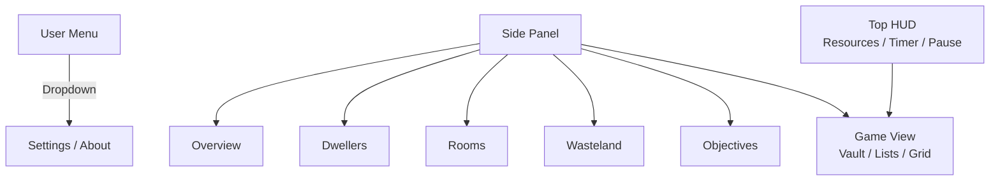
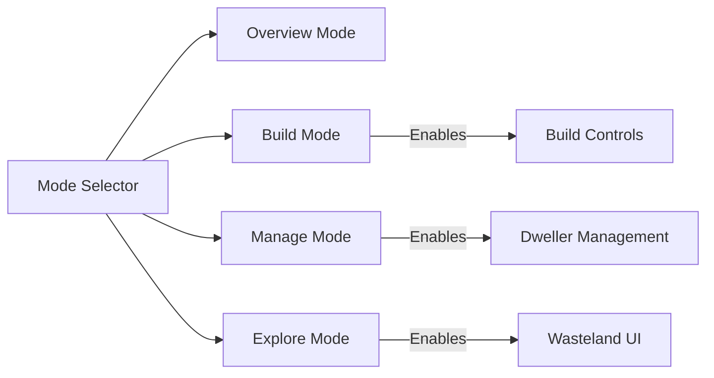

Below is a **condensed, opinionated styleguide / README section** you can drop
directly into your repo.

It focuses on **navigation modernization** while preserving your Fallout /
terminal identity, and includes **Mermaid diagrams** for layout.

---

# UI Navigation Styleguide

This project uses a **diegetic, game‑first UI** inspired by Fallout Shelter.
Modernization should **reduce clutter and increase context**, not introduce
generic web‑app patterns.

---

## Design Goals

- Keep the **Pip‑Boy / terminal aesthetic**
- Navigation must be **contextual**
- Prefer **modes** over pages
- Separate **gameplay UI** from **meta UI**
- Minimize permanent top navigation

---

## Navigation Principles

### 1. Modes over pages

Navigation represents **game modes**, not website sections.

| Mode     | Purpose                   |
|----------|---------------------------|
| Overview | Read-only vault state     |
| Build    | Room placement & upgrades |
| Manage   | Dwellers & assignments    |
| Explore  | Wasteland & expeditions   |

Modes define:

- visible controls
- allowed actions
- layout density

---

### 2. Contextual Side Panel (Primary Navigation)

The main navigation is a **collapsible left panel**.

- Visible only during gameplay
- Collapses to icons
- Expands on hover or keybind
- Themed like a terminal menu

#### Side Panel Contents

- Overview
- Dwellers
- Rooms
- Wasteland
- Objectives

Meta pages are excluded.

---

### 3. Minimal Top HUD

The top area is reserved **only for live game state**.

Allowed elements:

- time / timer
- pause button
- resources
- user dropdown

No navigation links here.

---

### 4. Meta UI Isolation

Non-game pages are removed from gameplay flow.

Accessed via user menu:

- Profile
- Settings
- About
- Logout

---

## Layout Reference

### Gameplay Screen Layout

---

### Mode-Based Layout (Conceptual)

---

## Screen-Specific Guidelines

### Vault Screen

- Side panel visible
- Build mode activates bottom or contextual controls
- No global navbar

### Dwellers Screen

- List-focused layout
- Filter & sort are primary
- Breadcrumb or side panel toggle only

### Vault List (Home)

- Minimal top bar
- No side panel
- Focus on vault cards

---

## Visual Style Rules

✅ Keep:

- monochrome green palette
- glow effects
- scanlines
- terminal fonts

✅ Improve:

- spacing & hierarchy
- hover / focus states
- transitions (slide, fade)
- keyboard navigation

❌ Avoid:

- generic SaaS navbars
- permanent top navigation
- mixing meta & gameplay UI

---

## Recommended Migration Path

1. Remove meta links from top navbar
2. Introduce user dropdown (top-right)
3. Convert navbar → side panel
4. Introduce mode-based navigation
5. Make navigation contextual per screen

---

## Accessibility & UX Notes

- Keyboard-first navigation is encouraged
- Modes should be switchable via hotkeys
- Visual feedback > textual feedback
- Navigation should never interrupt gameplay

---

## Summary

> The UI is a **vault terminal**, not a website.

Navigation should feel:

- in-world
- purposeful
- minimal
- expandable

Modern UX is achieved through **context and motion**, not more buttons.

---
